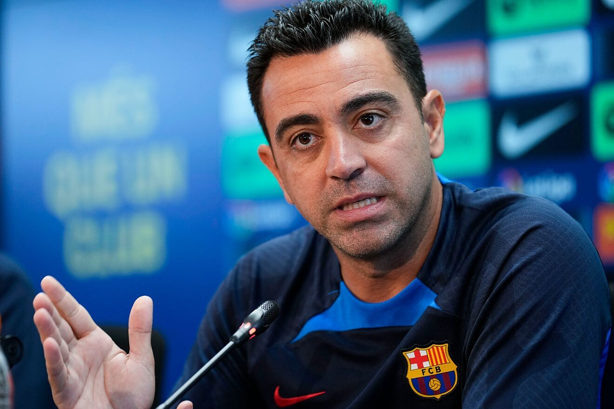

# Currículum

### PERFIL
- Mi nombre es Joan Ramon Valero y tengo 17 años.
 
### POBLACIÓN
- Vivo en Esparreguera ( Barcelona ).

### EDUCACIÓN
## Instituto El Cairat
- 13/09/2017 – 22/06/2021
- Título de la ESO. 

## IFP Hospitalet
- 13/09/2021 – Cursando el ciclo
- Actualmente estoy en el 2º año del ciclo medio de Sistemas Microinformáticos y tengo conocimientos de Linux y Windows.

### EXPERIENCIA LABORAL
- De momento aún no he tenido experiencia laboral porqué me estoy centrando en estudiar, y después de haberme sacado un Grado Superior ya iré a buscar trabajo. 

### APTITUDES
- Inglés – Nivel B1 y estudiando para el examen del First.

- Español – Lengua materna.

- Catalán – Segunda Lengua.
